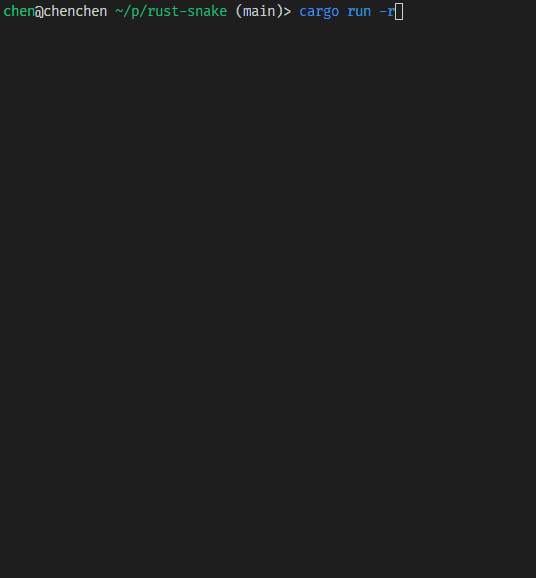

# Snake Game by Rust

## 摘要

贪吃蛇是一款经典的小游戏，适合编程练手。本文介绍了使用 rust 配合 crossterm crate 实现一个命令行版的贪吃蛇小游戏。最终代码文件总行数 293，代码行数 263，在不使用任何游戏开发框架的情况下，这个代码量还是比较少的，一定程度上也体现了 Rust 自身的抽象能力。最终实现的效果如下：



文章内容主要包括了：整体的实现思路，应用到的 Rust 知识点及 Crossterm crate，关键代码展示，以及遗留问题。

## 1. 实现思路

Snake game 包含的基础的实体有 snake, food, wall；它们都是由 cell 组成，food 是一个 cell，而 snake 和 wall 是 cell 的集合。一个 cell 就是小的长方块，有位置和大小属性。

snake 需要实现 `move_body`, `grow_body`，`check_bite_food`, `check_bite_self`, `check_collide_wall` 等方法。

最后需要一个 game 对象将这些游戏实体串起来。除了包含 snake, food, wall 游戏实体，game 对象还要存储一些状态，如`score`, `time` 和 `is_over`。Game 的关键方法就是游戏循环 `looping`，它包括了*窗口渲染*，_事件处理_，*状态更新*三个步骤。

## 2. 知识点

### 2.1 基础知识点

- `VecDeque` 是一个双端队列向量，类似于 `Vec`，但它处理一端插入另一端推出的效率更高。在游戏实现中，用来表示 snake body，身体移动就是通过在 body 头部加入一个 cell，尾部再移除一个 cell 实现的。
- 游戏进程的暂停，通过 `std::thread::sleep` 关联函数来实现
- 检查游戏时间流逝，通过 `std::time::{Instant, Duration}` 两个 struct 来实现
- 代码实现中应用了各种不同的 Iterator 方法，和不同的模式匹配方式

### 2.2 Crates

- Crossterm

  Crossterm 是一个终端控制库，可用来实现 Text User Interface，除了可以显示风格化的字符与符号，还可以响应一些外部事件，如鼠标、键盘和窗口缩放。基本的使用可以参考其[文档](https://docs.rs/crossterm/0.23.2/crossterm/)。绘图命令的执行方式建议使用 `queue!` 的 Lazy 执行方式。

- rand

  生成指定范围内的随机整数：`rand.thread_rng().gen_range(start .. end)`

## 3. 关键代码片断

主要的类型定义: `Cell`, `Snake`, `Wall`, `Game` 等

```rust
struct Cell {
    pos: (u16, u16), // (horizontal coord, vertical coord)
    size: (u16, u16), // (horizontal length, vertical length)
}

struct Snake {
    body: VecDeque<Cell>,
    dir: Direction,
}

struct Wall {
    cells: Vec<Cell>,
}

struct Game {
    wall: Wall,
    snake: Snake,
    food: Cell,
    score: u16,
    time: Instant,
    time_step: Duration,
    is_over: bool,
}

enum Direction {
    Up,
    Down,
    Left,
    Right,
}

enum Color {
    Red,
    Blue,
    White,
}
```

Snake 的主要方法：

```rust
pub fn grow_body(&mut self) {
    self.body.push_front(self.head().clone_with_pos_shift(self.dir, 1));
}

pub fn move_body(&mut self) {
    self.body.push_front(self.head().clone_with_pos_shift(self.dir, 1));
    self.body.pop_back();
}

pub fn check_bite_body(&self) -> bool {
    self.body.iter().skip(1).any(|c| c == self.head())
}

pub fn check_bite_food(&self, food: &Cell) -> bool {
    self.head() == food
}

pub fn check_overlap_food(&self, food: &Cell) -> bool {
    self.body.iter().any(|c| c == food)
}

pub fn check_collide_wall(&self, wall: &Wall) -> bool {
    wall.cells.iter().any(|c| c == self.head())
}
```

游戏实体的绘制。由于 cell 是最基础的游戏实体，snake, food, wall 都由 cell 组成，所以游戏界面的绘制主要就在 cell 方法中实现。

```rust
fn render<T: Write>(&self, output: &mut T, color: Color) -> Result<()> {
    for x in self.pos.0..self.pos.0 + self.size.0 {
        for y in self.pos.1..self.pos.1 + self.size.1 {
            queue!(
                output,
                cursor::MoveTo(x, y),
                style::PrintStyledContent(match color {
                    Color::Red => "█".red(),
                    Color::Blue => "█".blue(),
                    Color::White => "█".white(),
                })
            )?;
        }
    }
    Ok(())
}
```

外部事件处理

```rust
fn process_event(&mut self) -> Result<()> {
    if event::poll(Duration::from_millis(0))? {
        match event::read()? {
            Event::Key(KeyEvent {code: KeyCode::Up, ..}) => {
                if self.snake.dir != Direction::Down {
                    self.snake.dir = Direction::Up;
                }
            }
            Event::Key(KeyEvent {code: KeyCode::Down, ..}) => {
                if self.snake.dir != Direction::Up {
                    self.snake.dir = Direction::Down;
                }
            }
            Event::Key(KeyEvent {code: KeyCode::Left, ..}) => {
                if self.snake.dir != Direction::Right {
                    self.snake.dir = Direction::Left;
                }
            }
            Event::Key(KeyEvent {code: KeyCode::Right, ..}) => {
                if self.snake.dir != Direction::Left {
                    self.snake.dir = Direction::Right;
                }
            }
            Event::Key(KeyEvent {code: KeyCode::Char('q'), ..}) => self.is_over = true,
            _ => (),
        };
        // flush bufferred events before next loop
        while event::poll(Duration::from_millis(0))? {
            event::read()?;
        }
    }
    Ok(())
}
```

游戏状态更新

```rust
fn update_game_state(&mut self) {
    if self.snake.check_bite_body() || self.snake.check_collide_wall(&self.wall) {
        self.is_over = true;
    }
    if self.snake.check_bite_food(&self.food) {
        self.score += 1;
        self.snake.grow_body();
        // generate new food: update food position
        loop {
            self.update_food_pos();
            if !self.snake.check_overlap_food(&self.food) {
                break;
            }
        }
    } else {
        self.snake.move_body();
    }
}
```

## 4. 遗留问题

- 在 Windows 系统上，Terminal，PowerShell，CMD 测试都没问题，Terminal 效果最好。
- 在 macos 系统内，corssterm 无法响应外部事件，我测试了 Terminal, iTerm2 两个终端都不行。看了 crossterm 的[介绍文档](https://crates.io/crates/crossterm)，测试的 terminal 确实不包括 Macos 系统上的 terminal。
  - 后续：在程序开始处加上 `terminal::enable_raw_mode()?;` 可以解决 Linux/Unix 上外部事件无法响应的问题。
- 屏幕刷新频次低，有频闪的感觉，没有办法解决。
